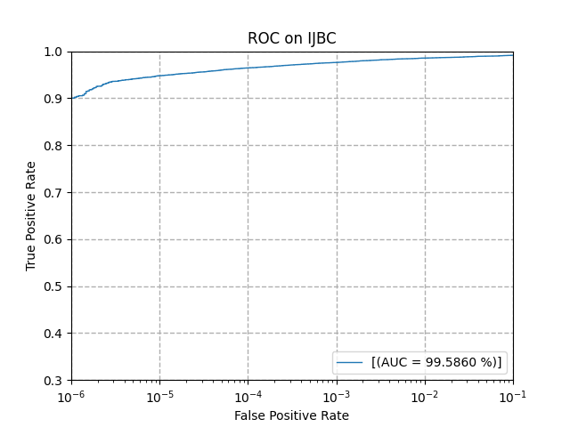
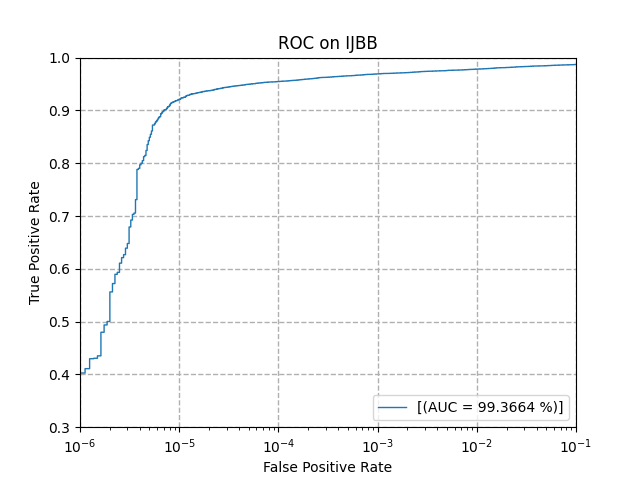
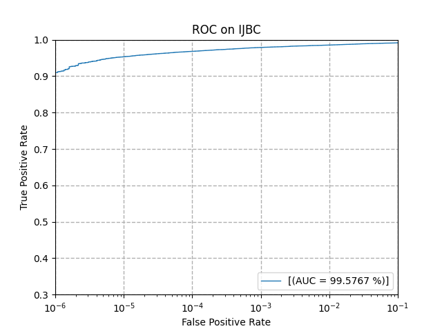

<h1 align="center">  Arcface Implementation in Pytorch </h1>

The ArcFace face recognition models and source codes are obtained from [InsightFace](https://github.com/deepinsight/insightface) Github projects.


## 1. Requirements

- Install Pytorch (torch>=1.6.0).
- Install `tensorboard`, `mxnet`, `easydict`, `onnx`, `sklearn`.

- Download the dataset
  from [Datasets](https://github.com/Naima-Bou/XAIface_Face_Recognition_Pipelines/tree/main/Datasets).

## 2. How to Train?

To train a model, run `train.py` with the path to the configs:

 -  <h4> Single node, 8 GPUs:</h4>

```shell
python -m torch.distributed.launch --nproc_per_node=8 --nnodes=1 --node_rank=0 --master_addr="127.0.0.1" --master_port=1234 train.py configs/ms1mv3_r50
```

- <h4> Multiple nodes, each node 8 GPUs: </h4> 

<h5> - Node 0: </h5> 

```shell
python -m torch.distributed.launch --nproc_per_node=8 --nnodes=2 --node_rank=0 --master_addr="ip1" --master_port=1234 train.py train.py configs/ms1mv3_r50
```

<h5> - Node 1: </h5> 

```shell
python -m torch.distributed.launch --nproc_per_node=8 --nnodes=2 --node_rank=1 --master_addr="ip1" --master_port=1234 train.py train.py configs/ms1mv3_r50
```

## 3. Pretrained Models

- The pretrained models can be found in [ArcFace Face Recognition Models](https://github.com/Naima-Bou/XAIface_Face_Recognition_Pipelines/tree/main/Face_Recognition/ArcFace_Face_Recognition/Face_Recognition_Models).


## 4. How to Test? 

*Note: Additional requirements are `pandas`, `menpo` and `prettytable`.*
Commandline-call (example)
```shell
CUDA_VISIBLE_DEVICES=0 python verify_ArcFace_IJBx.py --model-prefix H:/Common/avm_projects/XAIface/ArcFace_models/backbone_resnet50.pth --image-path H:/DATA/XAIface/ijb/IJBB --target IJBB --batch-size 128 --network r50
```

### Verification test (IJB verification protocol)
#### IJBB dataset, ResNet50 backbone (expected result)
Expected result for **ijbc-IJBB** (29.03.2022)

|  FPR [1]    | 1e-06 | 1e-05 | 0.0001 | 0.001 |  0.01 |  0.1  |
| :---        | :----:| :----:| :----: | :----:| :----:| :----:|
| **TPR [%]** | 38.21 | 91.34 | 95.00  | 96.60 | 97.88 | 98.68 |


#### IJBC dataset, ResNet50 backbone (expected result)
Expected result for **ijbc-IJBC** (29.03.2022)

|  FPR [1]    | 1e-06 | 1e-05 | 0.0001 | 0.001 |  0.01 |  0.1  |
| :---        | :----:| :----:| :----: | :----:| :----:| :----:|
| **TPR [%]** | 90.03 | 94.79 | 96.46  | 97.62 | 98.55 | 99.14 |



#### IJBB dataset, ResNet100 backbone (expected result)
Expected result for **ijbc-IJBB** (29.03.2022)

|  FPR [1]    | 1e-06 | 1e-05 | 0.0001 | 0.001 |  0.01 |  0.1  |
| :---        |:-----:| :----:| :----: | :----:| :----:| :----:|
| **TPR [%]** | 40.26 | 92.09 | 95.47  | 96.92 | 97.84 | 98.70 |



#### IJBC dataset, ResNet100 backbone (expected result)
Expected result for **ijbc-IJBC** (29.03.2022)

|  FPR [1]    | 1e-06 | 1e-05 | 0.0001 | 0.001 |  0.01 |  0.1  |
| :---        | :----:| :----:| :----: | :----:| :----:| :----:|
| **TPR [%]** | 90.99 | 95.31 | 96.81  | 97.88 | 98.54 | 99.17 |



### Identification test (IJB identification protocol)
Expected result (29.03.2022)

| **metric** | IJBB ResNet-50 | IJBC ResNet 50 | IJBB ResNet-100 | IJBC ResNet-100 |
| :---                  | :----: | :----: | :----: | :----: |
|**correct rank-1  [%]**| 95.122 | 96.402 | 95.453 | 96.754 |
|**correct rank-5  [%]**| 97.040 | 97.693 | 97.186 | 97.800 |
|**correct rank-10 [%]**| 97.478 | 98.020 | 97.585 | 98.117 |
|**FAR 0.1 % @ TPR [%]**| 33.437 | 73.787 | 36.855 | 76.318 |
|**FAR  1  % @ TPR [%]**| 83.126 | 92.462 | 84.732 | 92.936 |
|**FAR 10  % @ TPR [%]**| 93.963 | 95.264 | 94.732 | 95.851 |


